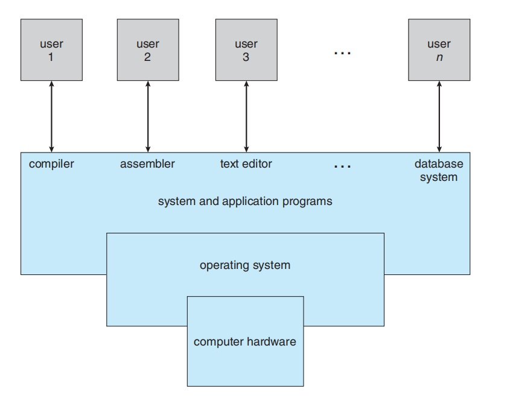

# Introduction

## Define Operating Sysytem??
- Operating systema acts as a Intermediatry device between the computer software(i.e the user of the computer) and the computer hardware. The purpose of an Operating System is to provide an enviroment in which user can execute **programs** in a convenient and **efficient** manner.

An operating system is a program that manages a computer’s hardware. It
also provides a basis for application programs and acts as an intermediary
between the computer user and the computer hardware. An amazing aspect of
operating systems is how they vary in accomplishing these tasks. Mainframe
operating systems are designed primarily to optimize utilization of hardware

some operating systems are designed tobe convenient, others to be efficient, 
and others to be some combination of the two.

*Goals of an Operating System:-*
- Executes user programs and make solving user problems easier.
- Make the computer system convenient to use.
- Use the computer hardware in an efficient manner.

## What Operating Systems Do??
A computer system can be divided roughly into four components:-
the hardware, the operating system, the application programs,and the users.

The hardware—the central processing unit (CPU), the memory, and the
input/output (I/O) devices—provides the basic computing resources for the
system. The application programs—such as word processors, spreadsheets,
compilers, and Web browsers—define the ways in which these resources are
used to solve users’ computing problems. The operating system controls the
hardware and coordinates its use among the various application programs for
the various users.

The operating system provides the means for proper use of these
resources in the operation of the computer system. An operating system is
similar to a government. Like a government, it performs no useful function by
itself. It simply provides an environment within which other programs can do
useful work.

